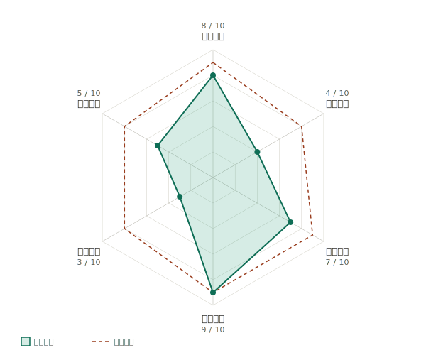

# 声音大百科 · 产品战略文档

> 面向 1-6 岁儿童的开源声音认知产品。通过真实声音帮助孩子认识自然与世界。
> 本文档定义产品定位、现状评估、改进路线和战略决策。
> 技术实现详见 [开发文档](开发文档.md)。

---

## 一、产品定位

| 维度 | 内容 |
|------|------|
| 产品名称 | 声音大百科（Sound Encyclopedia） |
| 目标用户 | 1-6 岁儿童（家长陪同操作） |
| 核心价值 | 用真实声音帮助孩子认识自然、动物与世界 |
| 核心承诺 | 真实声音 + 极简交互 + 零识字门槛 |
| 商业模式 | 不考虑商业化，专注开源社区共建 |
| 仓库地址 | https://github.com/wbyan2021/sound-encyclopedia |

### 设计原则

- 数据与代码分离：加声音零改代码
- 贡献门槛最低化：从不会 Git 的家长到开发者都能参与
- 零成本部署：GitHub Pages，无后端
- 版权干净：CC0（素材）+ MIT（代码）

### 社区共建闭环

```
社区贡献者 → 提 PR（上传 MP3 + meta.json）
  → GitHub Actions 自动校验
  → 人工 Review → 合并到 main
  → build-manifest.js 自动生成索引
  → 前端 fetch manifest.json 动态渲染
  → 孩子点击 → 播放声音
```

---

## 二、产品现状评估

> 2026年6月评估。从六个维度审视产品成熟度。



### 2.1 产品价值（8/10）—— 项目最扎实的地方

1-6 岁儿童的声音认知，市面产品基本两类：电子合成音效（假得离谱）或识字 App 顺带放声音（本末倒置）。本产品填补了「真实声音 + 极简交互 + 零识字门槛」的空白。

家长痛点：孩子天天看屏幕，但屏幕给的是视觉刺激，声音这种「被动输入、激发想象」的维度被严重低估。

**扣分点**：价值成立但深度不够。孩子点 38 个动物听一遍，新鲜感过了就没有「为什么要再打开一次」的理由。

### 2.2 内容深度（4/10）—— 最大短板

38 种动物，96 个音频。数量不差，但产品视角看：

- **覆盖窄**：预留了自然/交通/生活 4 大分类，但只有动物有数据。3 个空分类是坏体验。
- **重复访问价值低**：点完一圈就完了。没有「今日推荐」「新声音上线」「按场景组合」这类持续内容。
- **缺少教育纵深**：孩子听到狗叫，然后呢？没有「这是什么狗」「狗为什么这么叫」这种从声音延伸的知识。声音是钩子，知识才是留住用户的鱼线。

**方向**：别急着扩分类，先把动物这条线做深。每个动物加一段 30-50 字儿童友好科普文案（`fun_fact` 字段），点击后能展开看。这比再加 20 种动物的 ROI 高得多。

### 2.3 用户体验（7/10）—— 形态对了，细节还差口气

**做对的**：
- 开始页 → 加载 → 主界面流程清晰
- 点击即播放，符合儿童使用习惯
- 动画反馈（弹跳+星星+波纹）给得很足
- 音量控制是刚需

**差口气的地方**：

| 问题 | 严重度 | 说明 |
|------|--------|------|
| 预加载 96 个文件 | **高** | 移动网络下 13MB 全量预加载是灾难。应改为懒加载——点哪个加载哪个 |
| 没有播放状态指示 | 中 | 卡片之间无法区分「正在播」和「已播过」 |
| 无搜索/收藏 | 中 | 38 个还能滚动找，到 100 个必须有搜索。收藏让孩子有「我的」归属感 |
| SW 缓存策略不当 | 低 | manifest.json 也用了 cache-first，会导致新声音不上线。应改为 network-first |
| 无家长区 | 中 | 1-6 岁是家长陪玩，家长需要一个入口看「这 App 讲什么/怎么用/贡献声音」 |

### 2.4 技术架构（9/10）—— 隐藏王牌

数据驱动 + 自动校验 + 自动构建 + GitHub Actions + 单仓库零依赖。这个架构的扩展性足够撑到 500+ 声音不用重构。

**扣 1 分**：缺少测试。build-manifest.js 和 validate.js 是整个系统的地基，没有测试用例。哪天脚本崩了，PR 全卡住，排查会很痛。

### 2.5 社区生态（3/10）—— 现在是单机游戏

搭了社区贡献的管道（Issue 模板、PR 模板、Actions、CONTRIBUTING），但管道里没有水。

- 0 个外部贡献者
- 0 个 Issue
- 0 个 PR
- README 写得很好但没人看

开源项目的冷启动比产品本身难 10 倍。现在状态是「精心装修但没挂牌的房子」。

### 2.6 可持续性（5/10）—— 最该想清楚的问题

一个残酷的事实：纯开源 + 纯免费 + 无商业模式 = 大概率死掉。不是诅咒，是开源项目的统计规律。

**必须回答的问题**：三年后，谁在维护这个项目？动力是什么？

可能的答案（不冲突）：
- **公益基金/教育机构赞助**：定位成「儿童数字启蒙公共资源」，找教育基金会谈
- **增值服务**：声音库永久免费，但「无网络离线包」「亲子课程包」收费
- **企业 CSR**：找字节/腾讯的教育公益部门，让他们把维护接过去
- **纯个人热爱**：自己维护，但要有心理准备

**建议**：先别想商业模式，但**现在就写「项目可持续性声明」**放进 README。说清楚：这是公益项目、维护者是谁、如何贡献、如果维护者不干了怎么办。透明比承诺重要。

---

## 三、改进路线图

### 总览

| 阶段 | 内容 | 优先级 | 状态 |
|------|------|--------|------|
| Phase-0 | 仓库骨架搭建 | — | ✅ 完成 |
| Phase-1 | V1 声音迁移（38 动物 / 96 音频） | — | ✅ 完成 |
| Phase-2 | 前端数据驱动改造 + 动画/音量/SW | — | ✅ 完成 |
| **Phase A** | 体验修复 | **P0** | ⬜ 待做 |
| **Phase B** | 内容建设 | **P0** | ⬜ 待做 |
| Phase C | 社区冷启动 | P1 | ⬜ 待做 |
| Phase D | 可持续性 | P2 | ⬜ 待做 |

### Phase A：体验修复（P0）

**目标**：让产品在移动端「可用」，而不是「13MB 加载中用户跑了」。

| 任务 | 说明 |
|------|------|
| 懒加载 | 点击时加载音频，加载过的自动缓存。替代全量预加载 13MB |
| 空分类过滤 | 前端的分类 tabs 只显示有数据（sounds count > 0）的分类 |
| SW 策略修正 | manifest.json 改为 network-first，音频保持 cache-first |
| 播放状态指示 | 卡片上区分「正在播放」「已听过」「未播放」三种状态 |
| 加载/错误状态 | 音频加载中显示 loading 动画，加载失败显示友好提示 |

### Phase B：内容建设（P0）

**目标**：兑现「让孩子在家认识真实世界」的核心承诺。

| 任务 | 说明 |
|------|------|
| 自然声音 20 条 | 雨 / 风 / 海浪 / 雷 / 溪流 / 篝火 / 鸟鸣 / 虫鸣等 |
| fun_fact 科普文案 | 每个动物加 30-50 字儿童友好科普（meta.json 加 `fun_fact` 字段） |
| 前端科普面板 | 播放后底部滑出科普文案 + 标签 + 贡献者信息 |
| 搜索框 | 支持中文名、英文名、标签实时检索 |
| 收藏系统 | 心形按钮 + 专属「我的收藏」页 + localStorage 持久化 |
| 探索进度 | 记录已播放声音，显示百分比进度，解锁勋章称号 |
| 随机探索 | 随机跳转到一个声音并播放 |

### Phase C：社区冷启动（P1）

**目标**：从「单机游戏」变成「有人来玩的社区项目」。

| 任务 | 说明 |
|------|------|
| 自填 50 条 | 自然声音 + 交通 + 生活，让仓库看起来「活着」 |
| 找 3 个种子用户 | 幼儿园老师、宝妈群、早教社群 |
| 写传播故事 | 「一个 XX 为了让孩子在家听到大海的声音」——发小红书/即刻/公众号 |
| 降低贡献门槛 | 网页表单上传音频自动生成 PR（不做让用户操作 GitHub） |

### Phase D：可持续性（P2）

**目标**：确保项目长期存活。

| 任务 | 说明 |
|------|------|
| 可持续性声明 | 写进 README：维护者、维护承诺、断档预案 |
| 测试覆盖 | build-manifest.js 和 validate.js 的测试用例 |
| 教育机构合作 | 探索公益基金/教育机构赞助的可能性 |
| 维护者文档 | 如何交接、仓库 bus factor |

---

## 四、关键决策记录

| 决策 | 选择 | 理由 |
|------|------|------|
| 仓库结构 | 单仓库（data + 前端） | PR 一次搞定，未来可拆 |
| 图片方案 | emoji | 零版权、加载快、儿童友好 |
| 音频格式 | MP3 / 44100Hz / 128kbps | 兼容性最好 |
| 部署方式 | GitHub Pages | 免费、自动 |
| 管理方式 | Git + 脚本，不做后台 | 降低维护成本 |
| 商业模式 | 不考虑商业化 | 专注开源社区共建 |
| 版权协议 | CC0（素材）+ MIT（代码） | 最干净 |

---

## 五、风险与应对

| 风险 | 应对 |
|------|------|
| 版权纠纷 | 强制要求 source + license 字段，PR 模板勾选确认 |
| 音质参差 | 自动校验格式 + 人工 review 音质 |
| 响度不一致 | 规范要求 -16 LUFS，未来脚本可自动归一化 |
| 社区冷启动 | 先自己填 50+ 条自然声音，做出样子再推广 |
| 维护者流失 | 写可持续性声明 + 维护者交接文档 + 考虑机构合作 |

---

## 六、一句话总结

> **一个「价值清晰、架构扎实、内容单薄、社区空白」的早期项目。地基打得比大多数项目都好，但房子里还没住人。**
>
> 下个月做三件事：懒加载（P0）→ 填 20 条自然声音（P0）→ 每个动物加科普文案（P1）。先把产品本身做到「值得推荐」，再谈拉新。

---

*最后更新：2026-06-26*
